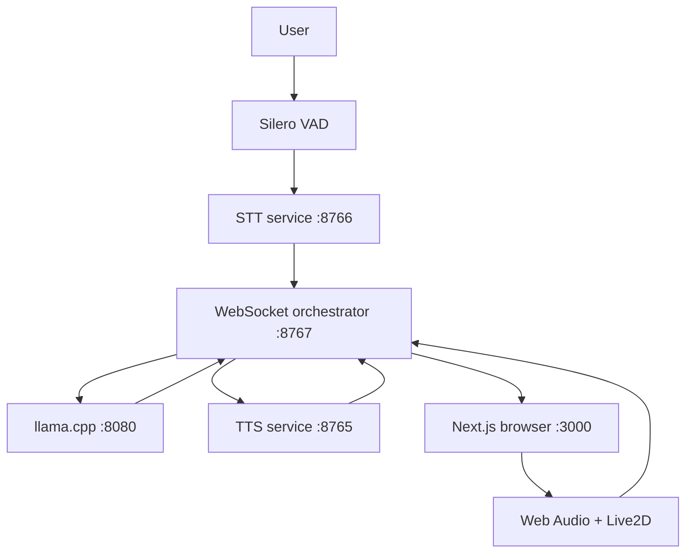
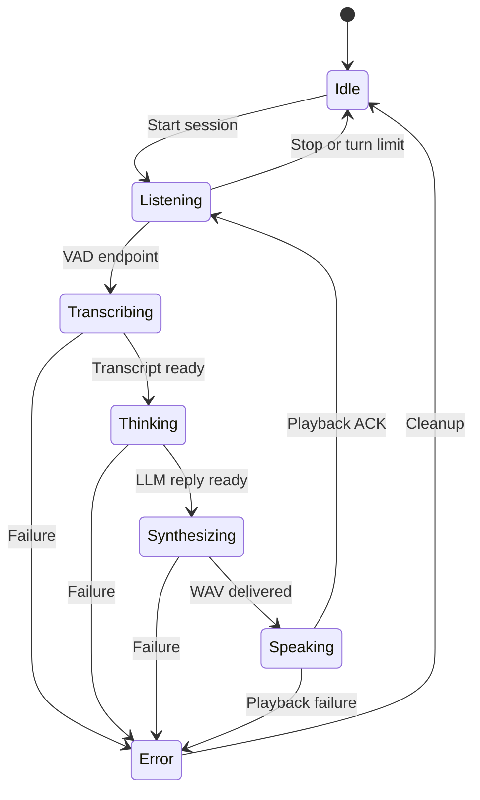

# Architecture

## 1. Scope

This document describes the validated **Demo Stable v0.9** architecture of the Local Voice-Interactive AI System. It does not describe every experiment in the private Development Snapshot.

The stable system is designed for one user on one Windows 11 laptop. All application services bind to `127.0.0.1`; there is no public network deployment in v0.9.

## 2. Design goals

- Run the complete voice-and-avatar loop on consumer laptop hardware.
- Keep the GPU available for local voice synthesis.
- Make state transitions and audio ownership explicit.
- Prevent the assistant from hearing its own speaker output.
- Keep model downloads, private voice references, logs, and runtime audio outside source control.
- Add components incrementally without destroying a previously validated fallback.

## 3. Non-goals

- Full-duplex interruption or simultaneous listening and speaking
- Remote or multi-user access
- Production authentication, tenancy, observability, or uptime guarantees
- Training new foundation models
- Real-time generative video avatars
- Automatic emotion-expression mapping in the stable build
- Long-term memory or J2 bounded-context behavior in the stable build
- Qwen3-4B as the stable LLM

## 4. Component map

| Component | Stable implementation | Resource | Interface |
|---|---|---|---|
| Voice activity detection | Silero VAD | CPU | In-process microphone capture and endpoint detection |
| Speech recognition | Faster-Whisper `small`, `cpu/int8` | CPU | Local HTTP service, `127.0.0.1:8766` |
| Language model | Qwen3-1.7B Q4_K_M through llama.cpp, `-ngl 0` | CPU | OpenAI-compatible local HTTP, `127.0.0.1:8080` |
| Speech synthesis | Qwen3-TTS 0.6B Base voice cloning | GPU | Local HTTP service, `127.0.0.1:8765` |
| Orchestration | Python WebSocket bridge | CPU | `ws://127.0.0.1:8767` |
| Frontend | Next.js production build (`next build --webpack` + `next start`), React, TypeScript | Browser | `http://127.0.0.1:3000` |
| Character | PixiJS + Live2D | Browser GPU | Client-side render loop |
| Lip sync | Web Audio analyser RMS | Browser | `ParamMouthOpenY` update loop |

## 5. Runtime topology

The browser connection does not itself start recording. A user action begins a controlled conversation session.

## 6. Turn lifecycle

The user-facing UI can group or label these states differently, but the orchestration boundary remains explicit.

## 7. Audio ownership and half-duplex behavior

Only one stage owns live audio at a time:

1. VAD opens the microphone while the system is listening.
2. Microphone capture ends before transcription and synthesis begin.
3. The orchestrator sends audio metadata followed by binary WAV bytes to the browser.
4. The browser validates the expected binary payload and decodes the WAV.
5. The browser sends `browser_playback_started`.
6. Web Audio playback drives an analyser node.
7. The analyser RMS value drives `ParamMouthOpenY` while the audio is playing.
8. Mouth state returns to neutral when playback ends or is cancelled.
9. The browser sends `browser_playback_finished`.
10. Only after the ACK does the orchestrator return to listening.

This ordering prevents the Python microphone path from running during assistant playback.

## 8. WebSocket event contract

The stable protocol carries JSON control/events and binary WAV payloads. Representative server events include:

- `session_ready`
- `state`
- `user_text`
- `assistant_text`
- `audio_ready`
- `playback_started`
- `session_stopped`
- `error`

Representative browser controls include:

- `start`
- `stop`
- `browser_playback_started`
- `browser_playback_finished`
- `browser_playback_cancelled`
- `audio_playback_error`

The exact event schema in source is authoritative. Documentation examples must not be used to bypass validation.

## 9. Resource allocation

The tested laptop has 8 GB GPU VRAM and 16 GB RAM. The architecture avoids placing every model on the GPU:

| Workload | Placement | Rationale |
|---|---|---|
| Silero VAD | CPU | Small, persistent endpoint detector |
| Faster-Whisper | CPU `int8` | Validated real-time factor; avoids GPU competition |
| Qwen3-1.7B | CPU through llama.cpp | Keeps VRAM available for TTS |
| Qwen3-TTS | GPU | Highest practical benefit from GPU in this chain |
| Live2D + RMS | Browser | Lightweight deterministic rendering compared with generative video |

The validated TTS implementation includes a GPU-usage guard/safety threshold. The exact public-release value must match the final Demo Stable source and must not be copied from an older Development baseline without verification.

## 10. Why Live2D is the stable avatar layer

Heavier real-time character generation or video-driving pipelines were considered during early planning. They would introduce another inference-heavy workload alongside STT, a local LLM, and TTS. On the validated RTX 4060 Laptop 8 GB / 16 GB RAM machine, that would increase resource contention and end-to-end latency.

The stable design deliberately uses **Live2D + Browser Audio + RMS Lip Sync**. It preserves visible character feedback and interaction, avoids an additional generative inference workload, gives the browser a predictable rendering role, and keeps GPU headroom available for local TTS. Browser Audio supplies the actual playback waveform, and RMS analysis maps that waveform to the mouth parameter, improving stability and responsiveness without presenting Live2D as a fallback of last resort.

## 11. Process and failure boundaries

- STT, LLM, TTS, WebSocket orchestration, and frontend run as separate local processes.
- Health checks run before a session starts.
- A failed downstream health check blocks the conversation rather than silently switching models.
- The stable TTS path does not download a missing model at request time.
- Browser audio payloads are size-limited and must come from the approved runtime output directory.
- Only one active conversation client is supported.
- Stop and error paths must close the listening/playback lifecycle and reset the mouth state.

## 12. Local network boundary

The validated services bind to loopback addresses only. The public package must preserve these invariants:

- no `0.0.0.0` configuration in v0.9;
- frontend origin allowlist for the WebSocket handshake;
- fixed or explicitly validated local ports;
- no remote file paths supplied to STT/TTS endpoints;
- no API keys embedded in browser code, source, or logs.

Loopback binding reduces exposure but is not a substitute for production authentication. See [docs/privacy.md](docs/privacy.md) and [docs/demo-limitations.md](docs/demo-limitations.md).

## 13. Stable and Development boundaries

The private Development Snapshot includes additional work that is not promoted into Demo Stable:

- J1-F.2 structured emotion tags and automatic expression mapping;
- J2 bounded context, summarization, and memory recall work;
- isolated Qwen3-4B feasibility tests;
- historical scripts, logs, and component experiments.

Promotion into Demo Stable requires independent tests, full-chain regression, manual browser validation, documentation updates, and renewed resource measurements.

