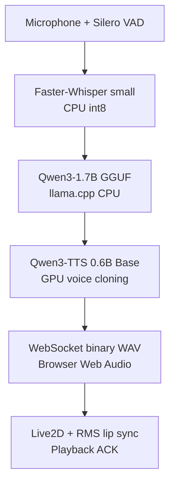

# Local Voice-Interactive AI System

[简体中文](README.zh-CN.md)

A Windows-first, locally orchestrated voice-interaction demo that connects voice activity detection, speech recognition, a local language model, voice-cloning TTS, browser audio, and a Live2D character in one controlled real-time pipeline.

This repository is prepared as a **Recruitment Preview v0.9**. It focuses on the engineering decisions, integration work, validation process, and resource trade-offs behind a working local demo. It is not presented as a production service or a general-purpose desktop assistant.

## Demo

- **60–90 second recruitment demo:** coming before public release
- **Sanitized screenshots:** pending final capture

No video, GIF, screenshot, or repository link is published here yet. This section will be updated only after the final captures have been reviewed for private audio, transcripts, local paths, and third-party asset permissions.

## Demo Stable status

The current Demo Stable build has passed manual 1-turn, 2-turn, and 6-turn regression on the target machine. Its validated path includes:

- Silero VAD → Faster-Whisper `small` CPU `int8` → Qwen3-1.7B GGUF/llama.cpp CPU → Qwen3-TTS 0.6B Base GPU;
- local WebSocket orchestration, Browser Web Audio, playback acknowledgement, and half-duplex anti-self-listening control;
- Live2D rendering with RMS-driven lip sync from the audio actually played;
- a production frontend built with `next build --webpack` and served with `next start`;
- finalized project identity, persona wording, and recruitment-oriented UI copy;
- unified Windows startup/shutdown with stale-PID recovery, listener-PID reconciliation, and TTS readiness gating;
- corrected production Live2D client configuration using browser-safe `NEXT_PUBLIC_LVIAI_*` URLs, followed by a final 1-turn speech smoke test.

These results describe the validated target environment. They do not claim broad hardware compatibility or production readiness.

## System overview

The stable demo uses a local, utterance-level, half-duplex conversation loop. The orchestrator waits for speech, transcribes it, obtains a local LLM response, generates speech, transfers the WAV to the browser, and waits for browser playback acknowledgement before reopening the microphone path.

See [ARCHITECTURE.md](ARCHITECTURE.md) for component responsibilities, ports, state transitions, and failure boundaries.

## Why this project matters

The project was built to explore a practical question: how can a multimodal conversational experience remain responsive and understandable on consumer laptop hardware without turning the system into a collection of unstable, competing GPU workloads?

The main work was not training a new foundation model. It was local AI systems engineering:

- separating CPU and GPU workloads;
- validating each model independently before integration;
- keeping services on loopback interfaces;
- building an explicit browser-audio acknowledgement protocol;
- preventing self-listening in a microphone/speaker loop;
- driving lip sync from the final playback signal instead of an estimated text animation;
- preserving validated fallback stages while adding new components.

## My Contribution

I designed and integrated the project as an end-to-end local AI system rather than treating it as a collection of disconnected model demos. My work included:

- designing the end-to-end architecture and defining clear service boundaries;
- allocating CPU and GPU workloads around an RTX 4060 Laptop 8 GB / 16 GB RAM constraint;
- integrating local VAD, STT, llama.cpp/Qwen3-1.7B, and Qwen3-TTS services;
- implementing the WebSocket orchestration and event/state flow between Python services and the browser;
- designing Browser Web Audio delivery with explicit playback-started and playback-finished acknowledgements;
- enforcing half-duplex control so listening resumes only after assistant playback, preventing self-listening;
- integrating Live2D in the production frontend;
- driving lip sync from the RMS level of the final browser playback signal;
- using staged validation and preserved fallback baselines to isolate failures safely;
- debugging cross-component runtime issues, including the development-server OOM, and hardening the Demo Stable packaging and release boundary.

The project demonstrates architecture, integration, resource scheduling, debugging, and stability validation. It does not claim that I trained the underlying foundation models.

## Technical decisions and design trade-offs

### CPU/GPU allocation

The target machine has an NVIDIA RTX 4060 Laptop GPU with 8 GB VRAM and 16 GB system RAM. The stable allocation is deliberately asymmetric:

- VAD: CPU
- STT: CPU `int8`
- Local LLM: CPU-only llama.cpp (`-ngl 0`)
- TTS: GPU
- Live2D rendering and audio analysis: browser

This keeps the GPU available for the workload that benefited most from it in the validated chain: local Qwen3-TTS voice synthesis.

### Why Live2D instead of a heavier generative avatar pipeline

Early planning considered heavier real-time character-generation and driving approaches. They were not selected for the stable demo. On an RTX 4060 Laptop GPU with 8 GB VRAM and 16 GB RAM, running STT, a local LLM, TTS, and a generative avatar at the same time would add significant VRAM, memory, and latency pressure. The final design deliberately uses **Live2D + Browser Audio + RMS Lip Sync** to retain visible character feedback and interaction, reduce additional generative inference load, reserve GPU capacity for local TTS, and improve end-to-end stability and responsiveness on consumer hardware.

The lip-sync signal comes from the RMS level of the audio being played in the browser. It does not predict mouth movement from text and does not use a video-generation model.

### Persistent services and explicit acknowledgements

STT and TTS are kept in local services to avoid repeated model loading. The browser sends explicit playback-started and playback-finished acknowledgements. Listening does not resume until playback has finished, which makes the half-duplex behavior observable and testable.

### Windows-first scope

The stable demo targets native Windows 11. Docker and WSL are not required for the validated path. Models and private assets are loaded locally and are not bundled in the public repository.

## Stable scope versus Development

The public Demo Stable line is intentionally narrower than the private Development line.

| Area | Demo Stable v0.9 | Development / future evaluation |
|---|---|---|
| Local LLM | Qwen3-1.7B GGUF | Qwen3-4B feasibility work |
| Conversation length | Validated 1/2/6-turn modes | Bounded-context and longer-memory work |
| Character response | Live2D + audio RMS lip sync | J1-F.2 automatic emotion-expression mapping |
| Audio | Browser playback with ACK | Additional streaming experiments |
| Deployment | One local Windows user | Remote, multi-user, or hosted deployment |

J1-F.2, J2, and the 4B model are **not completed Demo Stable features**.

## Hardware and environment

Validated target:

- Windows 11
- NVIDIA RTX 4060 Laptop GPU, 8 GB VRAM
- 16 GB system RAM
- Local browser frontend
- Separate Python environments for orchestration/STT and CUDA TTS
- Node.js/npm frontend environment

See [docs/windows-setup.md](docs/windows-setup.md) for the setup sequence and [docs/model-downloads.md](docs/model-downloads.md) for model placement.

## Repository and asset policy

The public repository is intended to contain source code, configuration templates, documentation, and sanitized test fixtures only. It does not include:

- model weights;
- llama.cpp binaries;
- private voice-reference audio or its transcript;
- generated or recorded runtime audio;
- conversation logs;
- unverified Live2D character assets;
- the private Development repository or its experimental history.

Read [docs/privacy.md](docs/privacy.md) and [THIRD_PARTY_NOTICES.md](THIRD_PARTY_NOTICES.md) before adding local assets.

## Documentation

- [Architecture](ARCHITECTURE.md)
- [Development log](DEVELOPMENT_LOG.md)
- [Known issues](KNOWN_ISSUES.md)
- [Roadmap](ROADMAP.md)
- [Third-party notices](THIRD_PARTY_NOTICES.md)
- [Windows setup](docs/windows-setup.md)
- [Model downloads](docs/model-downloads.md)
- [Privacy](docs/privacy.md)
- [Demo limitations](docs/demo-limitations.md)

## Current release stage

`v0.9` is in final GitHub packaging preparation. The Demo Stable runtime is frozen after 1/2/6-turn acceptance, launcher hardening, the Live2D production-configuration fix, and a final 1-turn speech smoke test.

The local Git repository has been initialized and the first recruitment-preview commits have been created. Before public release, the remaining gates are clean-clone validation, final dependency/version reconciliation, third-party redistribution verification, and review of sanitized screenshots and demo media.

## License status

No open-source license is granted for the original source code or documentation in this repository. Copyright © 2026 Enhua Liu. All rights reserved.

Third-party software, models, runtimes, voice materials, Live2D assets, and Cubism components remain subject to their respective licenses and terms. See [THIRD_PARTY_NOTICES.md](THIRD_PARTY_NOTICES.md) for component-specific terms and unresolved verification items.

## Copyright and Usage

Copyright © 2026 Enhua Liu. All rights reserved.

This repository is published primarily for portfolio and review purposes.

The original source code and documentation may be viewed for evaluation, but no license is granted for copying, modification, redistribution, or commercial use.

Third-party software, models, runtimes, and assets remain subject to their respective licenses and terms. See [THIRD_PARTY_NOTICES.md](THIRD_PARTY_NOTICES.md) for details.

