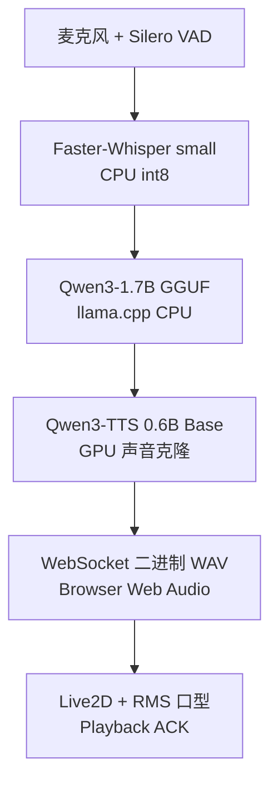

# 本地语音交互AI系统

[English](README.md)

这是一个面向 Windows 本机环境的语音交互 Demo，将语音活动检测、语音识别、本地大语言模型、声音克隆 TTS、浏览器音频和 Live2D 角色整合为一条可控的实时交互链路。

本仓库定位为 **GitHub Recruitment Preview v0.9**，重点展示系统设计、组件集成、验证过程和资源取舍。它不是生产服务，也不应被描述为通用桌面助手。

## Demo

- **60–90 秒招聘展示视频：** 正式公开前补充
- **脱敏截图：** 等待最终拍摄与审核

当前不虚构任何视频、GIF、截图或仓库链接。当前 tested Live2D character 和已批准的 generated cloned-voice media 已确认可用于公开展示。最终素材仍须检查私人参考材料、转录文本、本机路径以及是否意外包含源资产；媒体展示授权不等于 Live2D 原始模型文件或私人声音参考材料的再分发授权。

## Demo Stable 当前状态

最终 Demo Stable 已在目标电脑上通过 1 轮、2 轮和 6 轮人工回归。已验证的稳定链路包括：

- Silero VAD → Faster-Whisper `small` CPU `int8` → Qwen3-1.7B GGUF/llama.cpp CPU → Qwen3-TTS 0.6B Base GPU；
- 本机 WebSocket 编排、Browser Web Audio、播放 ACK 和 half-duplex 防自听控制；
- Live2D 与基于最终播放音频 RMS 的实时口型；
- 使用 `next build --webpack` 构建、`next start` 运行的 Production Frontend；
- 已完成的正式项目命名、Persona 文案和招聘展示 UI 文案。

这些结论仅对应已验证的目标环境，不代表广泛硬件兼容性或生产级成熟度。

## 系统链路

稳定版采用本机、逐句、半双工对话流程：VAD 完成截句后进行转录，本地 LLM 生成回复，TTS 合成语音，WebSocket 将 WAV 发送给浏览器；浏览器确认播放完成后，系统才恢复下一轮监听。

详细组件、端口和状态流转见 [ARCHITECTURE.md](ARCHITECTURE.md)。

## 项目重点

**项目核心价值是本地 AI 系统的架构设计、组件集成、资源调度和稳定性验证，而不是训练新的基础模型。** 具体工作包括：

- 按照资源特点分配 CPU/GPU；
- 每个组件先独立验证，再逐步接入完整链路；
- 所有服务只绑定回环地址；
- 建立浏览器音频 ACK 协议；
- 在扬声器与麦克风同时存在的情况下实现 half-duplex 防自听；
- 使用最终播放音频驱动真实 RMS 口型；
- 增加新功能时保留已验证的回退基线。

## 我的贡献

我把这个项目作为一套端到端本地 AI 系统进行设计与集成，而不是把几个模型演示简单拼接在一起。我的实际工作包括：

- 设计端到端架构并划分各本机服务的职责边界；
- 围绕 RTX 4060 Laptop 8 GB 显存、16 GB 内存进行 CPU/GPU 资源分配；
- 集成本地 VAD、STT、llama.cpp/Qwen3-1.7B 和 Qwen3-TTS 服务；
- 实现 Python 服务与浏览器之间的 WebSocket 编排、事件和状态流转；
- 设计 Browser Web Audio 传输及播放开始/结束 ACK；
- 实现 half-duplex 控制，使系统只在播放结束后恢复监听，避免 AI 听到自身输出；
- 在 Production Frontend 中完成 Live2D 集成；
- 使用浏览器最终播放音频的 RMS 驱动实时口型；
- 采用分阶段验证和保留回退基线的方式安全定位问题；
- 完成跨组件调试，包括开发服务器 OOM 的定位与修复，以及 Demo Stable 的包装和发布加固。

本项目展示的是架构、集成、资源调度、调试和稳定性验证能力，并不声称由我训练了底层基础模型。

## 技术决策与设计取舍

### CPU/GPU 资源分配

目标设备为 RTX 4060 Laptop 8 GB 显存和 16 GB 内存。稳定版采用：

- VAD：CPU
- STT：CPU `int8`
- 本地 LLM：llama.cpp CPU-only（`-ngl 0`）
- TTS：GPU
- Live2D 与音频分析：浏览器

这样可以把有限的 GPU 资源优先留给在当前链路中收益最明显的本地 Qwen3-TTS。

### 为什么最终选择 Live2D

早期曾考虑更重的实时人物生成和驱动路线，但没有将其作为稳定版方案。在 RTX 4060 Laptop 8 GB 显存、16 GB 内存的消费级硬件上，同时运行 STT、本地 LLM、TTS 和生成式数字人，会带来明显的显存、内存与延迟压力。因此最终主动采用 **Live2D + Browser Audio + RMS Lip Sync**：在保留人物反馈和交互感的同时，减少额外的生成式推理负载，把 GPU 资源优先留给本地 TTS，并提升端到端稳定性与响应性。

口型直接来自浏览器最终播放音频的 RMS 音量，不是根据文字猜测，也没有使用实时视频生成模型。

### 常驻服务与播放 ACK

STT 和 TTS 采用本机常驻服务，避免每轮重复加载模型。浏览器显式回传开始播放与播放结束事件；只有收到结束 ACK 后，系统才恢复监听，因此 half-duplex 行为可以被观察和测试。

## Demo Stable 与 Development 的边界

| 模块 | Demo Stable v0.9 | Development / 后续评估 |
|---|---|---|
| 本地 LLM | Qwen3-1.7B GGUF | Qwen3-4B 可行性测试 |
| 对话轮次 | 已验证 1/2/6 轮 | J2 有界上下文与更长记忆 |
| 数字人 | Live2D + RMS 口型 | J1-F.2 自动情绪表情映射 |
| 音频 | 浏览器播放 + ACK | 其他流式实验 |
| 部署 | 单用户 Windows 本机 | 远程、多用户或云端部署 |

**J1-F.2、J2 和 4B 不属于已经完成的 Demo Stable 功能。**

## 已验证硬件环境

- Windows 11
- NVIDIA RTX 4060 Laptop GPU，8 GB 显存
- 16 GB 内存
- 本机浏览器前端
- 编排/STT 与 CUDA TTS 使用相互隔离的 Python 环境
- Node.js/npm 前端环境

安装流程见 [docs/windows-setup.md](docs/windows-setup.md)，模型准备见 [docs/model-downloads.md](docs/model-downloads.md)。

## 公开仓库边界

公开仓库仅应包含源码、配置模板、文档和脱敏测试材料，不包含：

- 模型权重；
- llama.cpp 二进制；
- 私人声音参考音频和文本；
- 录音、生成语音与对话日志；
- Live2D 原始模型资源和 Cubism Core 运行时；
- 私有 Development 仓库和实验历史。

具体隐私与资产边界见 [docs/privacy.md](docs/privacy.md) 和 [THIRD_PARTY_NOTICES.md](THIRD_PARTY_NOTICES.md)。

## 文档目录

- [系统架构](ARCHITECTURE.md)
- [开发记录](DEVELOPMENT_LOG.md)
- [已知问题](KNOWN_ISSUES.md)
- [路线图](ROADMAP.md)
- [第三方组件说明](THIRD_PARTY_NOTICES.md)
- [Windows 安装](docs/windows-setup.md)
- [模型下载](docs/model-downloads.md)
- [隐私说明](docs/privacy.md)
- [Demo 能力边界](docs/demo-limitations.md)

## 当前发布阶段

`v0.9` 已进入 GitHub 最终发布包装阶段。Demo Stable 已完成 1/2/6 轮人工验收、launcher hardening、Live2D production 配置修复以及最终 1 轮语音 smoke test，并已冻结当前稳定运行版本。

本地 Git 仓库已完成初始化，并已经创建 Recruitment Preview 的首批本地提交。Clean-clone 验证已经通过：`.env`、私人/模型/音频/二进制资产均被排除，`npm ci`、ESLint、TypeScript `--noEmit`、Next.js production build、稳定契约测试 4/4 和 launcher hardening tests 均在全新本地 clone 中通过。

llama.cpp、Qwen3-1.7B GGUF、Qwen3-TTS 和 Faster-Whisper Small 的外部 artifact revision/checksum 已完成核对。最终 tracked-tree 与完整 Git 历史审计未发现阻止仓库由 Private 切换为 Public 的 P0/P1 问题。Silero 缓存的精确 commit、PyTorch wheel 的精确哈希，以及未来 Cubism 可运行发行物/媒体的 publication 分类继续作为 P2 跟进项；脱敏截图和 60–90 秒招聘视频属于展示完善工作，不阻止当前源码仓库公开。

## 许可证状态

本仓库中的原创源代码和文档目前不提供开源许可证。Copyright © 2026 Enhua Liu. All rights reserved.

第三方软件、模型、运行时、声音材料、Live2D 素材和 Cubism 组件仍受其各自许可证和使用条款约束。各组件的具体条款和待确认事项见 [THIRD_PARTY_NOTICES.md](THIRD_PARTY_NOTICES.md)。

## 版权、许可与使用说明

Copyright © 2026 Enhua Liu. All rights reserved.

本仓库主要用于个人作品集展示与招聘评估。仓库中的原创源代码和文档可供查看与评估，但目前不提供开源许可证，也未授予复制、修改、重新分发或商业使用的许可。

第三方软件、模型、运行时、声音材料、Live2D 素材和 Cubism 组件仍受其各自许可证和使用条款约束，详情请参阅 [THIRD_PARTY_NOTICES.md](THIRD_PARTY_NOTICES.md)。
